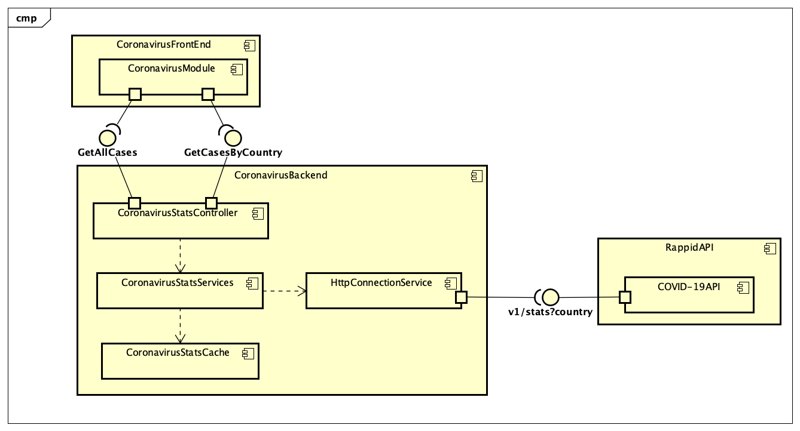

# Parcial Segundo Tercio ARSW

## Arquitectura

 Diagrama de Despliegue


 Diagrama de Componentes


## Ejecución Programa de forma local
1. Clonar el repositorio con el comando:
    ```
    git clone https://github.com/conejihan/Nicolas-Medina-ARSW-T2
    ```
2. Luego ejecutar los siguientes comandos en el cmd del proyecto clonado:
    ```
   mvn clean install
   mvn compile
   mvn spring-boot:run
   ```
3. Despues ingresar a la direccion "http://localhost:8080" en el buscador para ver la aplicación.

## Despliegue en Heroku
[](https://nicolas-medina-arsw-t2.herokuapp.com/)
